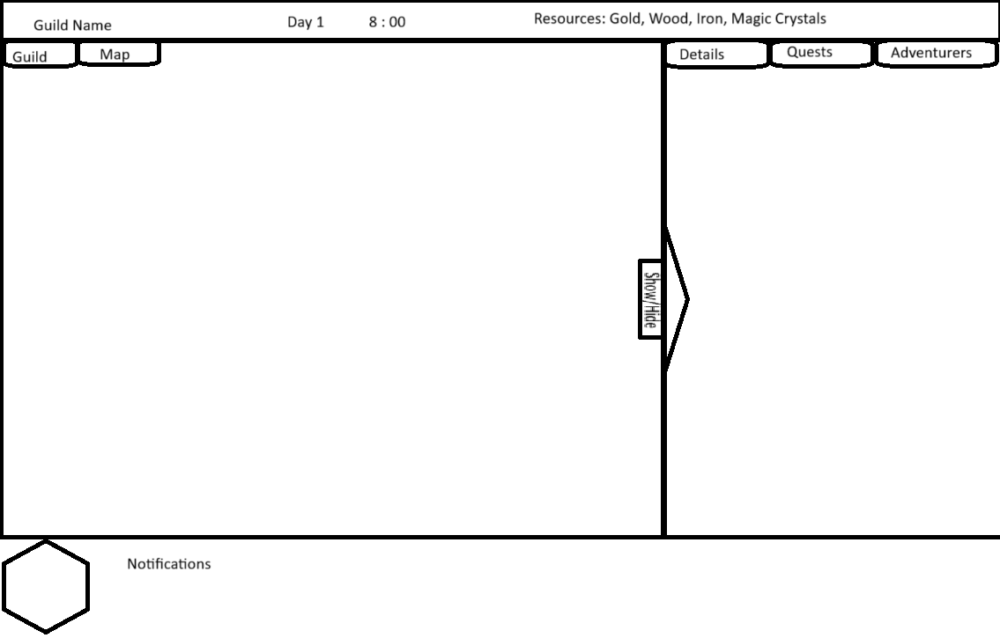

# Adventurer's Guild - Game Design Document

## Game Overview
Adventurer's Guild is a strategic management game where players take on the role of a guild master, managing a team of adventurers, assigning them to quests, and growing their guild's reputation and resources.

## Core Gameplay Loop
1. Recruit and manage adventurers
2. Assign adventurers to a party and send them on quests
3. Complete quests to earn rewards and reputation
4. Upgrade and maintain guild facilities
5. Manage randomized events based on progression

## Game Systems

### Adventurer System
- Each adventurer has unique stats and abilities
- Adventurers gain experience and level up
- Adventurers can be given an item to help in quests
- Adventurers can be injured or die on quests
- Adventurers need to rest and recover from injuries

### Quest System
- Various types of quests (combat, exploration, protection, gathering)
- Quests have different difficulty levels

### Guild Management
- Manage guild resources (gold, wood, stone, iron, magic crystals, reputation)
- Upgrade guild facilities
- Recruit new adventurers
- Handle clients and their quests

### Party System
- Create and manage parties of adventurers
- Assign parties to quests
- Track party status and progress
- Manage party equipment

## Features to Implement

### Core Systems
- [ ] Adventurer class with stats and abilities
- [ ] Party system for grouping adventurers
- [ ] Quest system with different types and difficulties
- [ ] Guild management system
- [ ] Resource management system
- [ ] Time management & notifications system
- [ ] Experience and leveling system
- [ ] Equipment and inventory system
- [ ] Save/Load system

### Game Mechanics
- [ ] Adventurer recruitment and management
- [ ] Quest assignment and completion
- [ ] Party formation and management
- [ ] Resource gathering and management
- [ ] Guild upgrades and expansion
- [ ] Combat system (if implemented)
- [ ] Random events and encounters

### UI/UX
- [ ] Main menu and game setup
- [ ] Guild management interface (Guild overiew, basic game view)
- [ ] Adventurer management interface (list, with status and basic info, sortable, each adventurer is clickable to expand detailed view in  secondary window)
- [ ] Map interface with visual nodes (nodes become permanently visible once discovered)
- [ ] Quest/Party assignment interface (Party is formed to complete specific quest, disbanded upon return)
- [ ] Resource management interface (probably just a small part of the guild overview, always visible in the upper right corner of the screen)
- [ ] Time display and notification tab
- [ ] Save/Load interface
- [ ] Settings and options menu

### Technical Features
- [ ] Data persistence
- [ ] Game state management
- [ ] Event system
- [ ] Input handling
- [ ] Audio system
- [ ] Performance optimization
- [ ] Error handling and logging

## Technical Architecture

### Core Systems
- GameManager: Central game state management
- AdventurerManager: Handles adventurer creation and management
- PartyManager: Manages party formation and assignments
- MapManager: Handles map interactions and party movement during quests
- QuestManager: Handles quest generation and tracking
- RandomEventManager: Handles the random events that can happen during gameplay
- TimeManager: Handles the passing of time.
- NotificationManager: Handles notifications from different sources 
- ResourceManager: Manages game resources and economy
- SaveManager: Handles game saving and loading

### Data Structures
- Adventurer: Core character data and behavior
- Party: Group of adventurers
- Quest: Mission data and requirements
- Resource: Game resources and economy
- SaveData: Game state persistence

### Unity Integration
- ScriptableObjects for data configuration
- Prefabs for visual representation
- UI system for game interfaces
- Scene management for different game states

## Development Roadmap

### Phase 1: Core Systems
1. Implement basic adventurer system
2. Create Map
3. Develop quest system
4. Implement Time and Notification systems
5. Implement resource management
6. Add save/load functionality

### Phase 2: Game Mechanics
1. Add adventurer recruitment
2. Implement quest assignment
3. Create party management
4. Add resource gathering
5. Implement guild upgrades

### Phase 3: UI/UX
1. Create main menu
2. Implement guild interface
3. Add adventurer management
4. Create quest interface
5. Implement resource management

### Phase 4: Polish
1. Add sound effects and music
2. Implement visual effects
3. Add tutorial system
4. Balance game mechanics
5. Bug fixing and optimization 

## UI Conceptualization

*Overall UI layout structure*

### 1. Overall UI Structure

- **Header Bar:**  
  - Displays the guild name, current day and time, and all tracked resources (Gold, Wood, Iron, Magic Crystals).
- **Main Panel:**  
  - Contains two primary tabs: **Guild** and **Map**.
  - The content of this panel changes based on the selected tab.
- **Secondary Panel (Right):**  
  - Contains three tabs: **Details**, **Quests**, and **Adventurers**.
  - Can be shown or hidden using a toggle button. When hidden, the main panel expands to fill the space.
- **Notifications:**  
  - Displayed in the bottom left corner, providing alerts and events to the player.

---

### 2. Main Panel Use Cases

#### a. Guild Tab
- **Default View:**  
  - Shows a spatial layout of guild buildings and adventurers.
- **Selecting a Building:**  
  - Highlights the building.
  - The **Details** tab in the secondary panel displays information about the building (purpose, status, and, for the guildhall, comprehensive guild info).

  
  *Details panel showing a selected building (Guildhall) in the Guild view*

- **Selecting an Adventurer:**  
  - Highlights the adventurer.
  - The **Details** tab displays adventurer information (name, class, level, status, and possibly stats like kills or quests completed).

  
  *Details panel showing a selected adventurer in the Guild view*

#### b. Map Tab
- **Default View:**  
  - Shows a node-based map representing locations and connections.
- **Selecting a Node:**  
  - Highlights the node.
  - The **Details** tab displays basic information about the location.

  
  *Details panel showing a selected node in the Map view*

- **Selecting a Party:**  
  - Highlights the party (represented by a diamond) on a node.
  - The **Details** tab displays party information (active quest, current status, list of adventurers, held items, and action buttons for resolving events or abandoning quests).

  
  *Details panel showing a selected party in the Map view*

- **Quest Location Marker:**  
  - Triangles indicate quest locations on the map.

---

### 3. Secondary Panel Use Cases

- **Details Tab:**  
  - Context-sensitive; shows information about the last selected object (building, adventurer, node, or party).
- **Quests Tab:**  
  - Lists all quests, divided into:
    - **Active Quests:** With assigned parties; double-clicking may switch to party details.

      
      *Quests tab showing active quests and their assigned parties*

    - **Pending Quests:** Awaiting party assignment, with a button to assign a party and start the quest.

      
      *Quests tab showing pending quests and assignment options*

    - **Completed Quests:** (Implied as a possible section.)
- **Adventurers Tab:**  
  - Lists all guild members with minimal details (icon, name, class, level, status).

---

### 4. Panel Behavior and Interaction Flow

- The secondary panel can be shown or hidden with a toggle button. When hidden, the main panel expands to use the full width of the screen.
- **Guild Tab Flow:**  
  - Click buildings or adventurers to view their details in the secondary panel.
- **Map Tab Flow:**  
  - Click nodes, parties, or quest markers to view details or take actions in the secondary panel.
- **Quests Tab Flow:**  
  - Manage quest assignments and view quest status.
- **Adventurers Tab Flow:**  
  - Quick overview of all guild members.
- **Notifications:**  
  - Always visible in the bottom left; clicking may open more detailed information or actions.

---

### 5. Visual Cues and Usability

- The currently selected/focused element is highlighted (yellow border or fill).
- The active tab in both the main and secondary panels is visually distinct.
- The UI is designed for clarity, with a strong separation between navigation (main panel) and context-sensitive information/actions (secondary panel).

**This documentation formalizes the intended UI behavior and layout as illustrated in your images, ensuring a clear reference for both design and implementation.** 